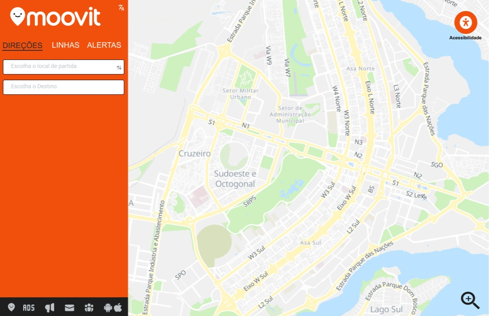
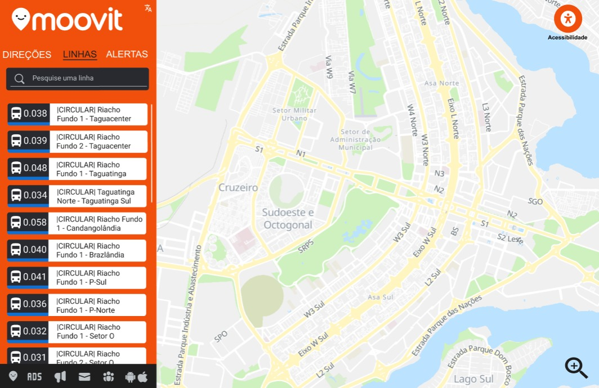
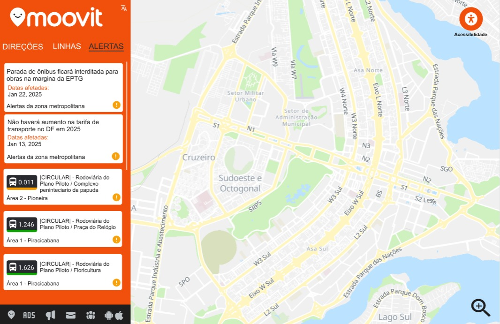

# Prototipação - [Moovit Website](https://moovitapp.com/)

Com base nos estudos realizados durante todo o semestre, de acordo com o territórios percorridos e as heuristicas priorizadas, esse foi o resultado final do nosso protótipo.

Priorizamos principalmente uma interface mais limpa e fluída, livre das diversas distrações que são encontradas na atual interface do moovit, como propagandas em excesso sendo mostradas. Mantemos o padrão que já existe no site, mas realizamos alterações nas cores e na forma como as informações são apresentadas em tela, no nosso entendimento, de uma forma mais limpa e de melhor entendimento para o usuário. Além disso adicionamos uma opção de acessibilidade, que não é encontrada  atualmente na aplicação. 

**[Protótipo - Moovit Web](https://www.figma.com/design/3odzQA0HazLkBSaQqo0F5o/Moovit-Web?node-id=23-4&p=f&t=a9sF3CqZewtwSWKA-0)**

